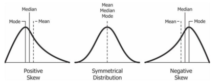

# Lesson: Summary Statistics

### Central Location Statistics

1.  Arithmetic Mean or Average: the sum of all values divided by the total count of values for a set of numbers.

```SQL 
SELECT AVG(measure_value)
FROM health.user_logs;
```
Recall: what were our measures called and how many record counts were there?

```SQL 
SELECT measure, count(*)
FROM health.user_logs
GROUP BY measure
ORDER BY 2 DESC; 
```

What if we want to take look at the AVG value across each measure? Does any specific measure_value drive the AVG? 

```SQL 
SELECT measure, Round(AVG(measure_value), 2) as average, count(*) as counts
FROM health.user_logs
GROUP BY measure
ORDER BY 3 DESC; 
```
We observe that AVG for measure_value weight is 28786.85. Which can skew our results. 

2. Median: the median shows the central location based off the values of the middle values. In probability theory - the median is also known as the 50th percentile value. It is the middle value which separates the bottom and top halves.

```SQL 
SELECT
PERCENTILE_CONT(0.5) WITHIN GROUP (ORDER BY measure_value) AS median_value
FROM health.user_logs
WHERE measure = 'weight';
```

- WITHIN GROUP is used to specify the order that the items in STRING_AGG will appear. For example, in your query if the GroupName "Headquarters" had three departments, "Sales", Marketing", and "Finance" the result would be "Finance, Marketing, Sales".

3. Mode: The mode is simply calculated as the value that appears the most number of times - but a given set of observations can have more than one mode!

```SQL 
SELECT
MODE() WITHIN GROUP (ORDER BY measure_value) AS mode_value
FROM health.user_logs
WHERE measure = 'weight';
```
4. Minimum, Maximum and Range: The minimum and maximum values of observations in a dataset help us identify the boundaries of where our data exists. We use the range calculation to show the total possible limits of our data by simply calculating the difference between the max and min values from our data.

```SQL 
SELECT
  MIN(measure_value) AS minimum_value,
  MAX(measure_value) AS maximum_value,
  MAX(measure_value) - MIN(measure_value) AS range_value
FROM health.user_logs
WHERE measure = 'weight';
```

Note: You can use EXPLAIN ANALYZE in front of each query and taking a look at the output, especially the Execution Time values.

5. Variance & Standard Deviation: the variance is the sum of the (difference between each X value and the mean) squared, divided by N - 1, 1 less than the total number of values.  Also, the variance is simply the square of the standard deviation. Keep in mind the variance and standard deviation are a measure of spread.

```SQL 
SELECT
  ROUND(VARIANCE(measure_value), 2) AS variance_value,
  ROUND(STDDEV(measure_value), 2) AS standard_dev_value
FROM health.user_logs
WHERE measure = 'weight';
```

6. The Empirical Rule or Confidence Intervals: 

One other way to interpret the standard deviation is the Empirical Rule


These boundaries are also known as confidence intervals or confidence bands - ranges where we are fairly sure that the data will lie within!

Quite commonly we will refer to these ranges as “one standard deviation about the mean” contains 68% of values etc.

One popular method to detect an uneven distribution in the dataset is to compare the average, mode and median values - this statistical property is known as a skew in the distribution.

