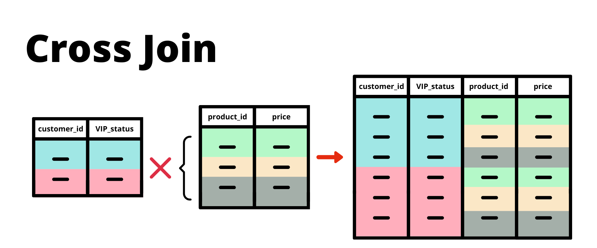

# Lesson: Table Joins 

### Sample Dataset: 

Names: 
| iid	|first_name	|title|
| -------- | ------- | -------- |
1	|Kate	|Datacated Visualizer
2	|Eric	|Captain SQL
3	|Danny	|Data Wizard Of Oz
4	|Ben	|Mad Scientist
5	|Dave	|Analytics Heretic
6	|Ken	|The YouTuber

jobs: 

iid|	occupation	|salary
| -------- | ------- | -------- |
1	|Cleaner	|High
2	|Janitor	|Medium
3	|Monkey	|Low
6	|Plumber	|Ultra
7	|Hero	|Plus Ultra


```SQL
DROP TABLE IF EXISTS names;
CREATE TEMP TABLE names AS
WITH input_data (iid, first_name, title) AS (
 VALUES
 (1, 'Kate', 'Datacated Visualizer'),
 (2, 'Eric', 'Captain SQL'),
 (3, 'Danny', 'Data Wizard Of Oz'),
 (4, 'Ben', 'Mad Scientist'),
 (5, 'Dave', 'Analytics Heretic'),
 (6, 'Ken', 'The YouTuber')
)
SELECT * FROM input_data;

DROP TABLE IF EXISTS jobs;
CREATE TEMP TABLE jobs AS
WITH input_data (iid, occupation, salary) AS (
 VALUES
 (1, 'Cleaner', 'High'),
 (2, 'Janitor', 'Medium'),
 (3, 'Monkey', 'Low'),
 (6, 'Plumber', 'Ultra'),
 (7, 'Hero', 'Plus Ultra')
)
SELECT * FROM input_data;
```

### Basic Table Joins: 

#### Inner Join:
An INNER JOIN or JOIN is used to get the intersection between two tables and return only the matching records.


```SQL 
SELECT
  names.iid,
  names.first_name,
  names.title,
  jobs.occupation,
  jobs.salary
FROM names
INNER JOIN jobs ON names.iid = jobs.iid;
```

iid|first_name| title|	occupation	|salary
| -------- | ------- | -------- | ------- | -------- |
1	|Kate | Datacated Visualizer| Cleaner	|High
2	|Eric|CaptainSQL |Janitor	|Medium
3	|Danny | DataWizard of Oz| Monkey	|Low
6	|Ken | The Youtuber |Plumber	|Ultra


Notice how only 4 records remain once we perform the INNER JOIN - this is essentially performing an intersection of the two datasets which meets the condition inside the ON clause.

In this case our ON clause or join condition is that the iid column is equal in both the names and the jobs table.

#### Left Join: 

The LEFT JOIN or LEFT OUTER JOIN is our second super common basic table join and it is used when you want to keep all the rows or records from the left table and return any matching records from the right table.


One of the fundamental concepts for this type of join is that the table on the left is also known as the “base” table where all of the rows are retained.

The “target” or right hand side table for the join will only return values when there is a match with records from the “base” table. When there is no match - the values for the specific “target” columns will be null for the non-matching rows.

```SQL 
SELECT
  names.iid,
  names.first_name,
  names.title,
  jobs.occupation,
  jobs.salary
FROM names
LEFT JOIN jobs ON names.iid = jobs.iid;
```
iid|first_name| title|	occupation	|salary
| -------- | ------- | -------- | ------- | -------- |
1	|Kate | Datacated Visualizer| Cleaner	|High
2	|Eric|CaptainSQL |Janitor	|Medium
3	|Danny | DataWizard of Oz| Monkey	|Low
4 | Ben | Mad Scientist | null |null
5 | Dave | Analytics Heretic | null | null
6	|Ken | The Youtuber |Plumber	|Ultra

Note how there are null values for the occupation and salary columns for Ben and Dave with respective iid values of 4, 5.

Since their iid values do not exist in the jobs table - when we perform a left join jobs onto the base table names - there are null records for these 2 non-matching rows for both the occupation and salary columns which originate from the jobs table.

#### Full Join: 
Sometimes there are occasions when you need to get the full combination of both tables to include all the rows and columns.


```SQL 
SELECT
  names.iid AS name_id,
  jobs.iid AS job_id,
  names.first_name,
  names.title,
  jobs.occupation,
  jobs.salary
FROM names
FULL JOIN jobs ON names.iid = jobs.iid;
```
name_iid|job_iid|first_name| title|	occupation	|salary
| --------  | -------- |------- | -------- | ------- | -------- |
1|1	|Kate | Datacated Visualizer| Cleaner	|High
2 |2	|Eric|CaptainSQL |Janitor	|Medium
3| 3	|Danny | DataWizard of Oz| Monkey	|Low
4 |null| Ben | Mad Scientist | null |null
5 |null | Dave | Analytics Heretic | null | null
6	|6 |Ken | The Youtuber |Plumber	|Ultra
null	|7 |null | null |Hero	| Plus Ultra


In the output above we can see how there are null values present in both the name_id and the job_id columns.

This behaviour mimics the same retention of rows in the LEFT JOIN we saw previously - but both sets of table rows are kept regardless whether they match or not with the adjoining table.

#### Cross Join: 

A cross join creates a full combination of all the rows in both tables that are being joined. This type of join is also referred to as a cartesian join which is taken from the original mathematical transformation - the cartesian product of two sets!




```SQL 
SELECT
  names.iid as name_iid,
  jobs.iid as job_iid,
  names.first_name,
  names.title,
  jobs.occupation,
  jobs.salary
FROM names
CROSS JOIN jobs;
```
name_iid|job_iid|first_name| title|	occupation	|salary
| --------  | -------- |------- | -------- | ------- | -------- |
1|1	|Kate | Datacated Visualizer| Cleaner	|High
1|2	|Kate | Datacated Visualizer| Janitor|Medium
1|3	|Kate | Datacated Visualizer| Monkey	|Low
1|6	|Kate | Datacated Visualizer| Plumber	|Ultra
1|7	|Kate | Datacated Visualizer| Hero	|Plus Ultra
2|1	|Eric | CaptainSQL | Cleaner	|High
2|2	|Eric | CaptainSQL | Janitor|Medium
2|3	|Eric | CaptainSQL | Monkey	|Low
2|6	|Eric | CaptainSQL | Plumber	|Ultra
2|7	|Eric | CaptainSQL | Hero	|Plus Ultra
3|1	|Danny | DataWizard of Oz | Cleaner	|High
3|2	|Danny | DataWizard of Oz | Janitor|Medium
3|3	|Danny | DataWizard of Oz | Monkey	|Low
3|6	|Danny | DataWizard of Oz | Plumber	|Ultra
3|7	|Danny | DataWizard of Oz| Hero	|Plus Ultra
4|1	|Ben | Mad Scientist | Cleaner	|High
4|2	|Ben | Mad Scientist | Janitor|Medium
4|3	|Ben | Mad Scientist | Monkey	|Low
4|6	|Ben | Mad Scientist | Plumber	|Ultra
4|7	|Ben | Mad Scientist | Hero	|Plus Ultra
5|1	|Dave | Analytics Heretic | Cleaner	|High
5|2	|Dave | Analytics Heretic | Janitor|Medium
5|3	|Dave | Analytics Heretic | Monkey	|Low
5|6	|Dave | Analytics Heretic | Plumber	|Ultra
5|7	|Dave | Analytics Heretic | Hero	|Plus Ultra
6|1	|Ken | The Youtuber | Cleaner	|High
6|2	|Ken | The Youtuber | Janitor|Medium
6|3	|Ken | The Youtuber | Monkey	|Low
6|6	|Ken | The Youtuber | Plumber	|Ultra
6|7	|Ken | The Youtuber | Hero	|Plus Ultra


Cross joins are also commonly seen with the following syntax also without the CROSS JOIN and instead just using a comma to separate the tables to be cross joined like so:

```SQL 
SELECT
  names.iid AS name_iid,
  jobs.iid AS job_iid,
  names.first_name,
  names.title,
  jobs.occupation,
  jobs.salary
FROM names, jobs;
```

#### Joins with Duplicates: 

What would happen if we have duplcate in our dataset? How will our joins be affected? 

I’ve added an extra row for iid = 1 and iid = 3 - so although this is not a complete duplicate - it does create a duplicate record in the iid column which we are going to join on. This should throw in a bit of curve ball to our joins now!

```SQL 
CREATE TEMP TABLE new_jobs AS
WITH input_table (iid, occupation, salary) AS (
 VALUES
 (1, 'Cleaner', 'High'),
 (1, 'Cleaner', 'Very High'),
 (2, 'Janitor', 'Medium'),
 (3, 'Monkey', 'Low'),
 (3, 'Monkey', 'Very Low'),
 (6, 'Plumber', 'Ultra'),
 (7, 'Hero', 'Plus Ultra')
)
SELECT * FROM input_table;
```
#### Duplicate Inner Join: 


```SQL 
SELECT
  names.iid,
  names.first_name,
  names.title,
  new_jobs.occupation,
  new_jobs.salary
FROM names
INNER JOIN new_jobs
  ON names.iid = new_jobs.iid;
  ```

iid	|first_name	|title	|occupation	|salary
| --------  | -------- |------- | -------- | -------|
1	|Kate	|Datacated Visualizer	|Cleaner	|Very High
1	|Kate	|Datacated Visualizer	|Cleaner	|High
2	|Eric	|Captain SQL	|Janitor	|Medium
3	|Danny	|Data Wizard Of Oz	|Monkey	|Very Low
3	|Danny	|Data Wizard Of Oz	|Monkey	|Low
6	|Ken	|The YouTuber	|Plumber	|Ultra

We can see that the same duplicates appear for Kate and Danny just like in the INNER JOIN output. 

These duplicates can really really mess up your analysis so what is the best way to deal with them?

This actually really depends on what you need to do with your joins. 

Let’s say that we only want to return the valid rows from the names table where the iid appears in the new_jobs table.

This is exactly where our LEFT SEMI JOIN comes in!

#### Left Semi Join:

A left semi join is actually really similar to an INNER JOIN where it captures only the matching records between left and right tables BUT it differs in one very key way: it only returns records from the left table - no columns or rows from the right table are included in the output.


```SQL 
SELECT
  names.iid,
  names.first_name
FROM names
WHERE EXISTS (
  SELECT iid
  FROM new_jobs
  WHERE names.iid = new_jobs.iid
);
```

```SQL 
SELECT
  names.iid,
  names.first_name
FROM names
LEFT SEMI JOIN new_jobs
ON names.iid = new_jobs.iid;
```

KEEP IN MIND: Table dont join if we have null values in the columns we are using for joining conditions. 


### Set Operations: 

#### Union: 

Simply put - UNION will be the union between two sets or SELECT results.


```SQL 
SELECT * FROM names where first_name = 'Danny'
UNION
SELECT * FROM names where first_name = 'Kate';
```
iid	|first_name	|title
|--------|--------|-----|
1	|Kate|	Datacated Visualizer
3	|Danny|	Data Wizard Of Oz

#### Union All: 


So the question you must have right now is: What is the difference between UNION and UNION ALL?

Simply - UNION runs a DISTINCT on the output result whilst UNION ALL does not.

This means that UNION ALL will be more performant as it does not run a relatively expensive DISTINCT

```SQL 
SELECT * FROM names where first_name = 'Danny'
UNION
SELECT * FROM names where first_name = 'Danny';
```
iid	|first_name	|title
|------|------|------|
3	|Danny	|Data Wizard Of Oz


```SQL 
ELECT * FROM names where first_name = 'Danny'
UNION ALL
SELECT * FROM names where first_name = 'Danny';
```
iid	|first_name	|title
|------|------|------|
3	|Danny	|Data Wizard Of Oz
3	|Danny	|Data Wizard Of Oz

#### Intersect: 


Intersect is pretty straightforward in that only the records which exist in both tables will be returned - a little bit similar to an INNER JOIN don’t you think?

In the following example - let’s try to find the intersection between all the records in names and a filtered dataset where only the records where the first name starts with ‘K’ are included:

```SQL 
SELECT * FROM names
INTERSECT
SELECT * FROM names where LEFT(first_name, 1) = 'K';
```
iid|	first_name	|title
|------|----------|-------|
1	|Kate	|Datacated Visualizer
4	|Ken	|The YouTuber

#### Except: 


```SQL 
SELECT * FROM names
EXCEPT
SELECT * FROM names where LEFT(first_name, 1) = 'K';
```
iid|	first_name	|title
|------|----------|-------|
3	|Danny	|Data Wizard Of Oz
5	|Dave	|Analytics Heretic
2	|Eric	|Captain SQL

Also note that EXCEPT has a default DISTINCT built in so it’s doing the same deduplication as the UNION

We can also combine these with 2+ queries - just be aware that all of these set operations will be executed in order from top to bottom! And also note also that the column names for the final result are according to the first query that was used in the combination!

```SQL 
SELECT * FROM names WHERE first_name = 'Danny'
UNION
SELECT * FROM names where LEFT(first_name, 1) = 'K'
EXCEPT
SELECT * FROM names where first_name = 'Kate';
```
iid|	first_name	|title
|------|----------|-------|
3	|Danny	|Data Wizard Of Oz
4	|Ken	|The YouTuber