# Lesson: Window Functions

Window functions are operations or calculations performed on “window frames” or put simply, groups of rows in a dataset.


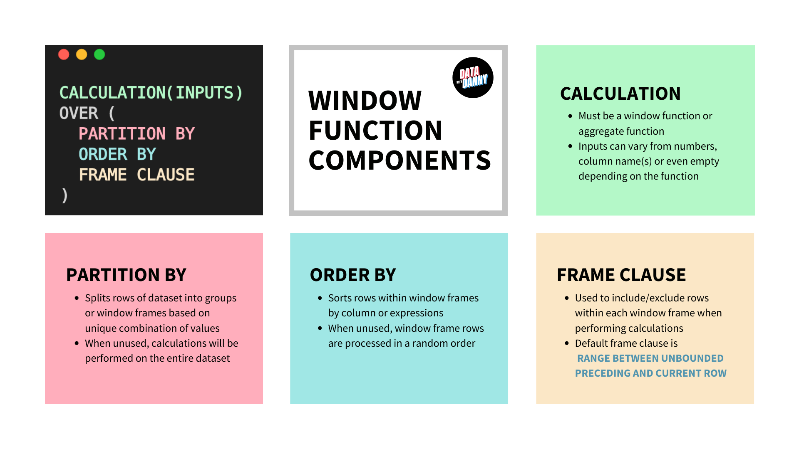


### Partition By
One of the easiest ways to understand the how the PARTITION BY component of window functions worked was to compare it to a basic GROUP BY query.


```SQL 
DROP TABLE IF EXISTS customer_sales;
CREATE TEMP TABLE customer_sales AS
WITH input_data (customer_id, sales) AS (
 VALUES
 ('A', 300),
 ('A', 150),
 ('B', 100),
 ('B', 200)
)
SELECT * FROM input_data;

-- Group By Sum
-- Note that the ORDER BY is only for output sorting purposes!
SELECT
  customer_id,
  SUM(sales) AS sum_sales
FROM customer_sales
GROUP BY customer_id
ORDER BY customer_id;

-- Sum Window Function
SELECT
  customer_id,
  sales,
  SUM(sales) OVER (PARTITION BY customer_id) AS sum_sales
FROM customer_sales;
```

Note:In GROUP BY columns are collapsed into one row, were as in PARTITION BY has gives all the rows.  

### Partition By 2 Columns

In the visual example below - you can think of the partitioning as splitting the dataset into smaller groups based on the unique combination of column values from each input to the PARTITION BY

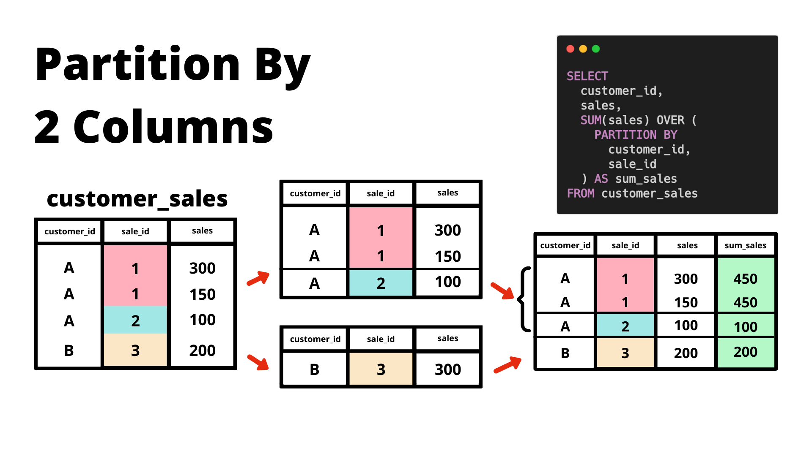

```SQL 
-- we remove that existing customer_sales table first!
DROP TABLE IF EXISTS customer_sales;
CREATE TEMP TABLE customer_sales AS
WITH input_data (customer_id, sale_id, sales) AS (
 VALUES
 ('A', 1, 300),
 ('A', 1, 150),
 ('A', 2, 100),
 ('B', 3, 200)
)
SELECT * FROM input_data;

-- Sum Window Function with 2 columns in PARTITION BY
SELECT
  customer_id,
  sales,
  SUM(sales) OVER (PARTITION BY customer_id,sale_id) AS sum_sales
FROM customer_sales;
```

### Partition By Multiple Level

We can also use different levels for multiple window functions in a single query - there is one very specific reason why we usually prefer to use window functions to perform multiple level aggregations in this way compared to other methods.

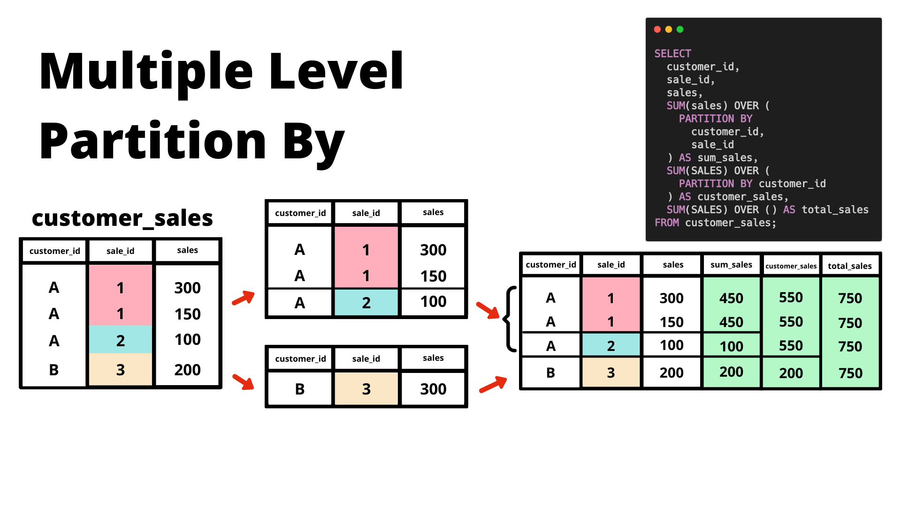

```SQL 
SELECT
  customer_id,
  sale_id,
  sales,
  SUM(sales) OVER (PARTITION BY customer_id,sale_id) AS sum_sales,
  SUM(SALES) OVER (PARTITION BY customer_id) AS customer_sales,
  SUM(SALES) OVER () AS total_sales
FROM customer_sales;
```

### Multiple Calculations

We can also apply multiple different window function calculations instead of just using the SUM function like we’ve been using for all the previous examples.

In the following example, we demonstrate how to use AVG and MAX window functions.

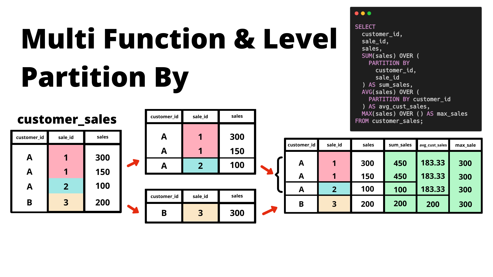

```SQL 
SELECT
  customer_id,
  sale_id,
  sales,
  SUM(sales) OVER (
    PARTITION BY
      customer_id,
      sale_id
  ) AS sum_sales,
  -- the average customer sales is rounded to 2 decimals!
  ROUND(
    AVG(sales) OVER (
      PARTITION BY customer_id
    ),
    2
  ) AS avg_cust_sales,
  MAX(sales) OVER () AS max_sales
FROM customer_sales;
```

Note: The default behaviour for PARTITION BY when the window function has an empty OVER clause is to perform calculations across all the rows of the dataset.


### Ordered Window Functions 
Logically - we can think of the ORDER BY happening after the PARTITION BY clause as the sorting of records will happen within each partition or group that is separated as part of the window function.

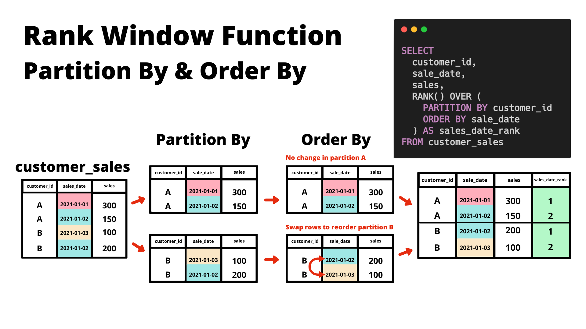


We can also use a ORDER BY DESC to sort our rows differently and it will provide a reversed outcome!


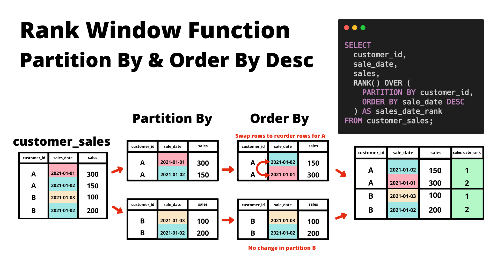

```SQL 
-- we remove any existing customer_sales table first!
DROP TABLE IF EXISTS customer_sales;
CREATE TEMP TABLE customer_sales AS
WITH input_data (customer_id, sales_date, sales) AS (
 VALUES
 ('A', '2021-01-01'::DATE, 300),
 ('A', '2021-01-02'::DATE, 150),
 ('B', '2021-01-03'::DATE, 100),
 ('B', '2021-01-02'::DATE, 200)
)
SELECT * FROM input_data;

-- RANK Window Function with default ORDER BY
SELECT
  customer_id,
  sales_date,
  sales,
  RANK() OVER (
    PARTITION BY customer_id
    ORDER BY sales_date
  ) AS sales_date_rank
FROM customer_sales;

-- RANK Window Function with descending ORDER BY
SELECT
  customer_id,
  sales_date,
  sales,
  RANK() OVER (
    PARTITION BY customer_id
    ORDER BY sales_date DESC
  ) AS sales_date_rank
FROM customer_sales;
```

Note:  If there is an empty partition clause - the ORDER BY will still take place - just on all the rows of the dataset as opposed within the separated groups like we would see with a non-empty PARTITION BY clause.

```SQL 
SELECT
  customer_id,
  sales_date,
  sales,
  RANK() OVER (
    ORDER BY sales_date DESC
  ) AS sales_date_rank
FROM customer_sales;
```

### Advanced Window Functions 

#### Bitcoin Mini Case Study: 
We will be focusing on Bitcoin daily trading volume and prices to illustrate how we can use window functions for something as interesting as trading in the cryptocurrency market!

We want to answer following questions: 

1. What is the earliest and latest market_date values?
2. What was the historic all-time high and low values for the close_price and their dates?
3. Which date had the most volume traded and what was the close_price for that day?
4. How many days had a low_price price which was 10% less than the open_price?
5. What percentage of days have a higher close_price than open_price?
6. What was the largest difference between high_price and low_price and which date did it occur?
7. If you invested $10,000 on the 1st January 2016 - how much is your investment worth in 1st of February 2021? Use the close_price for this calculation


Lets first begin with identifying NULL rows: 
```SQL 
SELECT *
FROM trading.daily_btc
WHERE (
open_price+ high_price+ low_price+ close_price+adjusted_close_price+volume)
IS NULL; 
```
Alternatively - we could have also just done a basic where filter with every single column being used as below:

```SQL 
SELECT *
FROM trading.daily_btc
WHERE
  market_date IS NULL
  OR open_price IS NULL
  OR high_price IS NULL
  OR low_price IS NULL
  OR close_price IS NULL
  OR adjusted_close_price IS NULL
  OR volume IS NULL
);
```


For our Bitcoin data example - we will need to fill in the missing values from our rows of data before we continue with our analysis. Usually null values will be ignored in many functions - however we want to make sure there are no null values in our data because there really should be data for every single day!

#### Lag To Fill Missing Values:

We use a Lag() function to access previous rows data as per defined offset value

```SQL 
SELECT
  market_date,
  open_price,
  LAG(open_price, 1) OVER (ORDER BY market_date) AS lag_open_price
FROM trading.daily_btc
WHERE market_date BETWEEN ('2020-04-17'::DATE - 1) AND ('2020-04-17'::DATE + 1);
```

####  Lead Alternate Implementation

The LEAD() window function takes a column and an integer offset as arguments and returns the value of the cell in that column that is the specified number of rows after the current row. 

```SQL 
SELECT
  market_date,
  open_price,
  LAG(open_price) OVER (ORDER BY market_date) AS lag_open_price,
  LEAD(open_price) OVER (ORDER BY market_date DESC) AS lead_open_price
FROM trading.daily_btc
WHERE market_date BETWEEN ('2020-04-17'::DATE - 1) AND ('2020-04-17'::DATE + 1);
```

#### Coalesce to Update Null Rows

COALESCE function does - just note the function can actually accept any number of columns or even raw values (as long as they are the data type) - the order is important as it will return the first non-null value from the inputs from left to right!

```SQL 
WITH april_17_data AS (
  SELECT
    market_date,
    open_price,
    LAG(open_price) OVER (ORDER BY market_date) AS lag_open_price
  FROM trading.daily_btc
  WHERE market_date BETWEEN ('2020-04-17'::DATE - 1) AND ('2020-04-17'::DATE + 1)
)
SELECT
  market_date,
  open_price,
  lag_open_price,
  COALESCE(open_price, lag_open_price) AS coalesce_open_price
FROM april_17_data;
```

#### Update Tables
```SQL
DROP TABLE IF EXISTS updated_daily_btc;
CREATE TEMP TABLE updated_daily_btc AS
SELECT
  market_date,
  COALESCE(
    open_price,
    LAG(open_price) OVER (ORDER BY market_date)
  ) AS open_price,
  COALESCE(
    high_price,
    LAG(high_price) OVER (ORDER BY market_date)
  ) AS high_price,
  COALESCE(
    low_price,
    LAG(low_price) OVER (ORDER BY market_date)
  ) AS low_price,
  COALESCE(
    close_price,
    LAG(close_price) OVER (ORDER BY market_date)
  ) AS close_price,
  COALESCE(
    adjusted_close_price,
    LAG(adjusted_close_price) OVER (ORDER BY market_date)
  ) AS adjusted_close_price,
  COALESCE(
    volume,
    LAG(volume) OVER (ORDER BY market_date)
  ) AS volume
FROM trading.daily_btc;

-- test that our previously missing value dates are filled!
SELECT *
FROM updated_daily_btc
WHERE market_date IN (
  '2020-04-17',
  '2020-10-09',
  '2020-10-12',
  '2020-10-13'
); 
```

Oh no!!! What happened to that 13th of October value???

Let’s take a look at a few records around that date from our newly created temporary table first:

```SQL 
SELECT *
FROM updated_daily_btc
WHERE market_date BETWEEN '2020-10-10'::DATE AND '2020-10-14'::DATE;
```
What about our original dataset?
```SQL 
SELECT *
FROM trading.daily_btc
WHERE market_date BETWEEN '2020-10-10'::DATE AND '2020-10-14'::DATE;
```
Well - what were the values for the 12th of October in our original dataset? Oh yeah - they were also null. 

Maybe we can use offset value of 2 instead of 1 for OCTOBER 13th. 

We can do this using several different ways: 
 

```SQL 
SELECT
  market_date,
  open_price,
  COALESCE(
    open_price,
    CASE
      WHEN market_date = '2020-10-13'
        THEN LAG(open_price, 2) OVER (ORDER BY market_date)
      ELSE LAG(open_price, 1) OVER (ORDER BY market_date)
      END
  ) AS adj_open_price
FROM trading.daily_btc
WHERE market_date BETWEEN '2020-10-10'::DATE AND '2020-10-13'::DATE;
```
OR 

```SQL 
SELECT
  market_date,
  open_price,
  COALESCE(
    open_price,
    CASE
      WHEN market_date = '2020-10-13'
        THEN LAG(open_price, 2) OVER (ORDER BY market_date)
      ELSE LAG(open_price, 1) OVER (ORDER BY market_date)
      END
  ) AS adj_open_price
FROM trading.daily_btc
WHERE market_date BETWEEN '2020-10-10'::DATE AND '2020-10-13'::DATE;
```
OR 
```SQL 
INSERT INTO testing_updated_daily_btc
SELECT
  '2020-10-13'::DATE AS market_date,
  open_price,
  high_price,
  low_price,
  close_price,
  adjusted_close_price,
  volume
FROM testing_updated_daily_btc
WHERE market_date = '2020-10-12'
RETURNING *;
```
Note: If you find that you are repeating a certain window multiple times in the same query - you can actually use the WINDOW clause after the final FROM section of your SQL query and refer to a simple alias in the window function call within the select expressions in the body of the SQL query.

Note that you can actually define multiple windows by using a comma separated list as shown below - you don’t even need to use them in the query - just be careful what you name your windows and do not get them mixed up with default SQL functions or any other variable/table name that you’ve created in the database session!

```SQL 
DROP TABLE IF EXISTS updated_daily_btc;
CREATE TEMP TABLE updated_daily_btc AS
SELECT
  market_date,
  COALESCE(
    open_price,
    LAG(open_price, 1) OVER w,
    LAG(open_price, 2) OVER w
  ) AS open_price,
  COALESCE(
    high_price,
    LAG(high_price, 1) OVER w,
    LAG(high_price, 2) OVER w
  ) AS high_price,
  COALESCE(
    low_price,
    LAG(low_price, 1) OVER w,
    LAG(low_price, 2) OVER w
  ) AS low_price,
  COALESCE(
    close_price,
    LAG(close_price, 1) OVER w,
    LAG(close_price, 2) OVER w
  ) AS close_price,
  COALESCE(
    adjusted_close_price,
    LAG(adjusted_close_price, 1) OVER w,
    LAG(adjusted_close_price, 2) OVER w
  ) AS adjusted_close_price,
  COALESCE(
    volume,
    LAG(volume, 1) OVER w,
    LAG(volume, 2) OVER w
  ) AS volume
FROM trading.daily_btc
-- NOTE: checkout the syntax where I've included an unused window below!
WINDOW
  w AS (ORDER BY market_date),
  unused_window AS (ORDER BY market_date DESC);

-- inspect a few rows of the updated dataset for October
SELECT *
FROM updated_daily_btc
WHERE market_date BETWEEN '2020-10-08'::DATE AND '2020-10-15'::DATE;
```

#### Cumulative Calculations

Let’s say for example - we also want to add a new column into our updated_daily_btc dataset which contains the cumulative sum of all previous traded volume up to and including that day’s worth of data.

To break this example down in case you haven’t come across cumulative metrics before - let’s investigate just the first 10 rows of the volume column from our updated_daily_btc dataset sorted by market_date and demonstrate what we need to do at a low level.

Take note that the volume metric is the total number of Bitcoins traded on that specific market_date!

```SQL 
SELECT
  market_date,
  volume
FROM updated_daily_btc
ORDER BY market_date
LIMIT 10;
```
So if we wanted to perform a cumulative sum calculation, adding the previous volume amounts to a running total. 

One way is to use something which is known as a self-join where we join one table back onto itself!

```SQL 
WITH volume_data AS (
  SELECT
    market_date,
    volume
  FROM updated_daily_btc
  ORDER BY market_date
  LIMIT 10
)
SELECT
  t1.market_date,
  t1.volume,
  SUM(t2.volume) AS running_total
FROM volume_data t1
INNER JOIN volume_data t2
  ON t1.market_date >= t2.market_date
GROUP BY 1,2
ORDER BY 1,2;
```
Some people really enjoy using this self-join technique and likely you will see this being used often in some SQL training examples online.

However - I’ve found that window functions are more efficient and also easier to read and understand and make it a bit clearer in terms of intent - it’s clear for anyone who reads the code what you are trying to do when you have clearly defined window functions, as opposed to someone second guessing why you have a join in the middle of a cumulative sum calculation!

```SQL 
WITH volume_data AS (
  SELECT
    market_date,
    volume
  FROM updated_daily_btc
  ORDER BY market_date
  LIMIT 10
)
SELECT
  market_date,
  volume,
  SUM(volume) OVER (ORDER BY market_date) AS cumulative_sum
FROM volume_data;
```

#### Window Frame Clause

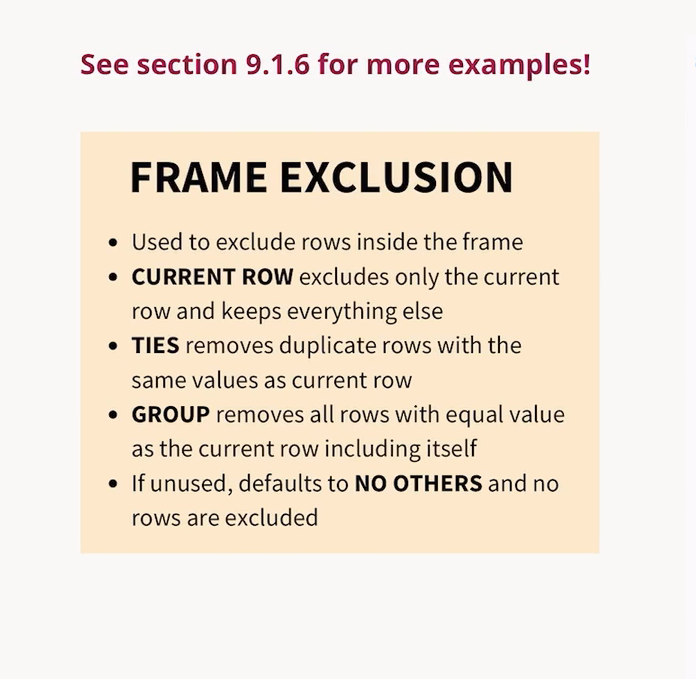


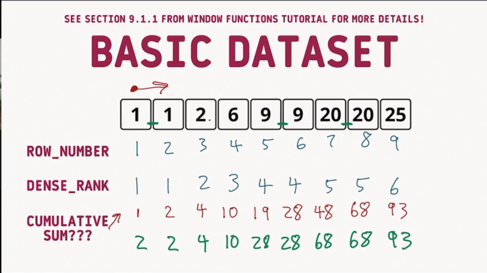

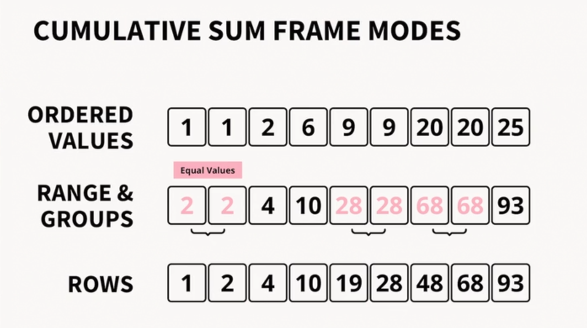

#### Offset and Unbounded
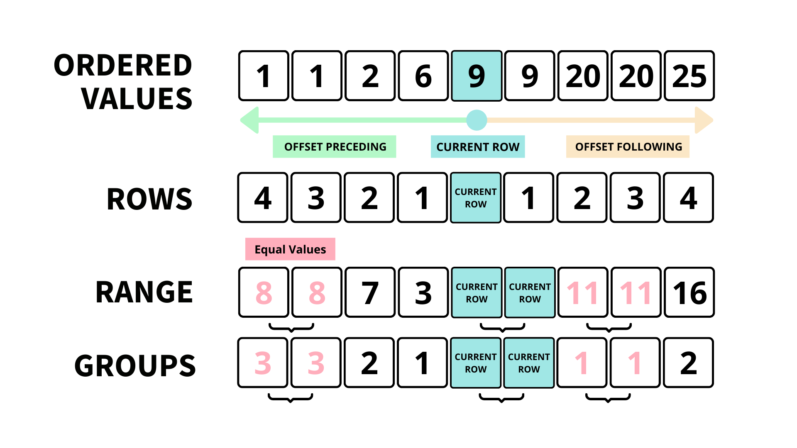 

#### Range Mode (Default Frame Mode)
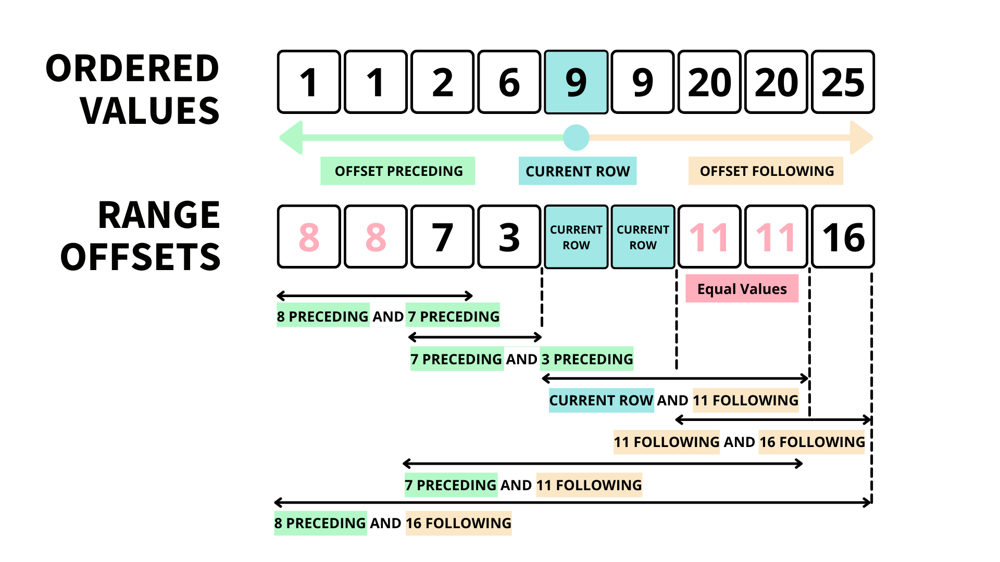 

#### Row Mode
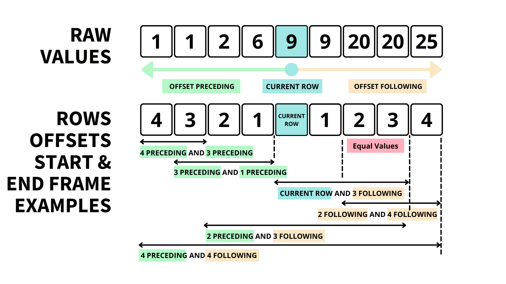 

#### Groups Mode
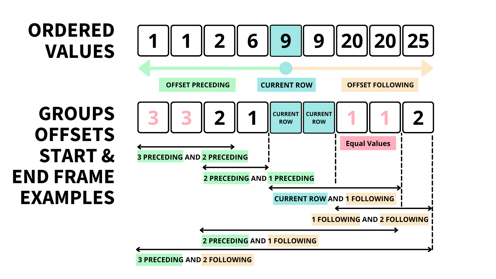

#### Frame Exclusion (FYI) 


#### Applied Window Functions

1. Moving Average:
```SQL 
SELECT
  market_date,
  close_price,
  -- averages
  ROUND(AVG(close_price) OVER w_14) AS avg_14,
  ROUND(AVG(close_price) OVER w_28) AS avg_28,
  ROUND(AVG(close_price) OVER w_60) AS avg_60,
  ROUND(AVG(close_price) OVER w_150) AS avg_150,
  -- standard deviation
  ROUND(STDDEV(close_price) OVER w_14) AS std_14,
  ROUND(STDDEV(close_price) OVER w_28) AS std_28,
  ROUND(STDDEV(close_price) OVER w_60) AS std_60,
  ROUND(STDDEV(close_price) OVER w_150) AS std_150,
  -- max
  ROUND(MAX(close_price) OVER w_14) AS max_14,
  ROUND(MAX(close_price) OVER w_28) AS max_28,
  ROUND(MAX(close_price) OVER w_60) AS max_60,
  ROUND(MAX(close_price) OVER w_150) AS max_150,
  -- min
  ROUND(MIN(close_price) OVER w_14) AS min_14,
  ROUND(MIN(close_price) OVER w_28) AS min_28,
  ROUND(MIN(close_price) OVER w_60) AS min_60,
  ROUND(MIN(close_price) OVER w_150) AS min_150
FROM updated_daily_btc
WINDOW
  w_14 AS (ORDER BY MARKET_DATE RANGE BETWEEN '14 DAYS' PRECEDING AND '1 DAY' PRECEDING),
  w_28 AS (ORDER BY MARKET_DATE RANGE BETWEEN '28 DAYS' PRECEDING AND '1 DAY' PRECEDING),
  w_60 AS (ORDER BY MARKET_DATE RANGE BETWEEN '60 DAYS' PRECEDING AND '1 DAY' PRECEDING),
  w_150 AS (ORDER BY MARKET_DATE RANGE BETWEEN '150 DAYS' PRECEDING AND '1 DAY' PRECEDING)
ORDER BY market_date DESC
LIMIT 10;
```

2. Weighted Moving Averages: 
```SQL 
WITH base_data AS (
  SELECT
    market_date,
    ROUND(close_price, 2) AS close_price,
    ROUND(AVG(close_price) OVER w_1_to_14) AS avg_1_to_14,
    ROUND(AVG(close_price) OVER w_15_28) AS avg_15_28,
    ROUND(AVG(close_price) OVER w_29_60) AS avg_29_60,
    ROUND(AVG(close_price) OVER w_61_150) AS avg_61_150
FROM updated_daily_btc
WINDOW
  w_1_to_14 AS (ORDER BY MARKET_DATE RANGE BETWEEN
    '14 DAYS' PRECEDING AND '1 DAY' PRECEDING),
  w_15_28 AS (ORDER BY MARKET_DATE RANGE BETWEEN
    '28 DAYS' PRECEDING AND '15 DAY' PRECEDING),
  w_29_60 AS (ORDER BY MARKET_DATE RANGE BETWEEN
    '60 DAYS' PRECEDING AND '29 DAY' PRECEDING),
  w_61_150 AS (ORDER BY MARKET_DATE RANGE BETWEEN
  '150 DAYS' PRECEDING AND '61 DAY' PRECEDING)
)
SELECT
  market_date,
  close_price,
  0.5 * avg_1_to_14 + 0.3 * avg_15_28 + 0.15 * avg_29_60 + 0.05 * avg_61_150 AS custom_moving_avg
FROM base_data
ORDER BY market_date DESC;
```
3. Exponential Weighted Average: 
```SQL 
DROP TABLE IF EXISTS ewma_output;
CREATE TEMP TABLE ewma_output AS
WITH RECURSIVE output_table
(market_date, close_price, sma_14, ewma_14, _row_number)
AS (

-- The 1st query: we set initial output row using _row_number = 15
  SELECT
    market_date,
    close_price,
    sma_14,
    sma_14 AS ewma_14,
    _row_number
  FROM base_table
  WHERE _row_number = 15

  UNION ALL

  -- The 2nd query: we need to "shift" our output by 1 row
  SELECT
    base_table.market_date,
    base_table.close_price,
    base_table.sma_14,
    -- Let's round out ewma_14 record to 2 decimal places
    ROUND(
      0.13 * base_table.sma_14 + (1 - 0.13) * output_table.ewma_14,
      2
    ) AS ewma_14,
    base_table._row_number
  FROM output_table
  INNER JOIN base_table
    ON output_table._row_number + 1 = base_table._row_number
    AND base_table._row_number > 15
)
SELECT * FROM output_table;

-- Finally show the outputs we generated
SELECT * FROM ewma_output LIMIT 10;
```